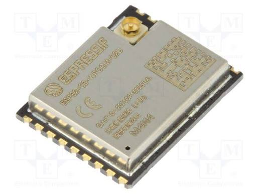
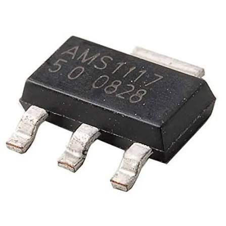
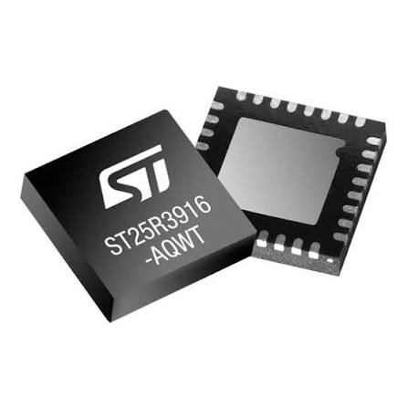

# SecuriVax 102 BOM

The list below is transcribed from the supplied custom-PCB parts list. Blank manufacturer and price fields were left blank rather than guessed.

| Name                            | Description                                                                  | Image                                                            |
| ------------------------------- | ---------------------------------------------------------------------------- | ---------------------------------------------------------------- |
| 10u capacitor (C1)              | Bulk supply decoupling capacitor, C0603                                      |           |
| 100n capacitor (C2)             | Local high-frequency decoupling capacitor, C0603                             |           |
| LED-0603_R (LED1)               | Red status LED, Everlight 19-217/R6C-AL1M2VY/3T, LCSC C72044                 |                         |
| 10k resistor (R1)               | Pull-up or bias resistor, R0603                                              |              |
| 5.1k resistor (R2)              | USB-C configuration resistor or board-defined pull-down, R0603               |              |
| 1k resistor (R3)                | LED current-limiting resistor, R0603                                         |              |
| ESP32-C3-WROOM-02-N4 (4MB) (U1) | Main 4 MB flash controller module, Espressif, LCSC C2934560                  |      |
| DHT22 (U2)                      | Temperature and humidity sensor, Haigu, LCSC C2880291                        |                  |
| BUTTON (U3, U4)                 | Two SMD tactile buttons, LCSC C9900015607                                    |                 |
| USB3.1 TYPE-C 06PF-073 (U5)     | USB-C power/programming connector, LCSC C9900187208                          |  |
| AMS1117M-5.0RG (U6)             | 5 V linear regulator, HGC, LCSC C2977139                                     |          |
| ST25R3916-AQWT (U7)             | NFC/RFID reader IC, ST, LCSC C2908147; requires the designed antenna network |                  |
| Custom PCB                      | Fabricated carrier PCB for the listed components                             |                   |

## Assembly quantities

| Category   | Quantity for one assembled PCB |
| ---------- | -----------------------------: |
| C1, C2     |                         1 each |
| LED1       |                              1 |
| R1, R2, R3 |                         1 each |
| U1         |                              1 |
| U2         |                              1 |
| U3, U4     |                              2 |
| U5, U6, U7 |                         1 each |
| Custom PCB |                              1 |

See [102 wiring](../../schematics/102-wiring.md) for component roles and the pin-verification checklist.
