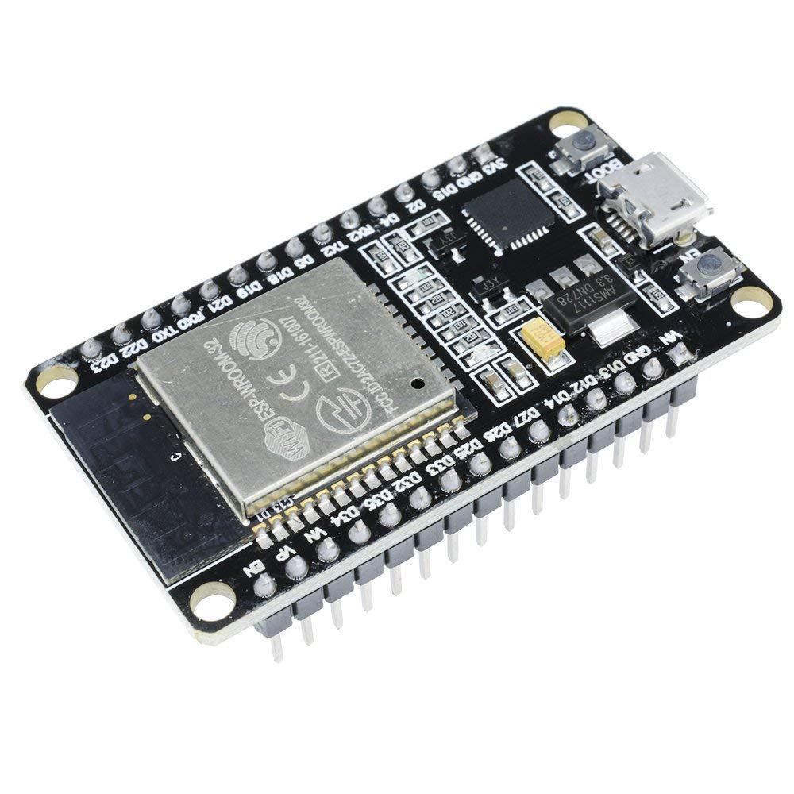
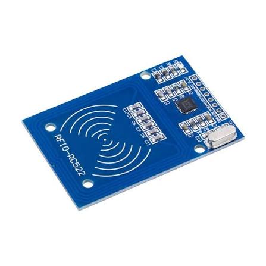
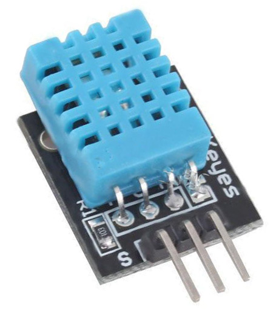
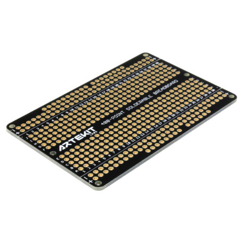

# Prototype 101 BOM

Prototype 101 is the hand-wired validation build. Quantities are the minimum for one unit.

| Name                     | Description                                                                     | Image                                                                          |
| ------------------------ | ------------------------------------------------------------------------------- | ------------------------------------------------------------------------------ |
| ESP32 DevKit WROOM-1     | Wi-Fi/Bluetooth microcontroller development board and USB programming interface |                                |
| RC522 RFID reader module | 13.56 MHz RFID reader used with the SPI bus                                     |                            |
| DHT11 sensor 1           | First temperature and humidity measurement channel                              |                               |
| DHT11 sensor 2           | Independent second channel for sensor fusion and disagreement detection         |                               |
| Prototype board          | Solderable carrier for point-to-point assembly                                  |  |
| Female header strips     | Removable sockets for ESP32 and sensor modules                                  |                         |
| Jumper wire kit          | 3.3 V, ground, SPI, reset, and sensor signal wiring                             |                       |
| 4.7-10 kOhm resistors    | Optional DHT data pull-ups when the sensor board has no fitted pull-up          |                            |
| USB cable                | Power and firmware upload cable for the ESP32                                   |                                   |

See [101 wiring](../../schematics/101-wiring.md) for the GPIO map and assembly checks.
