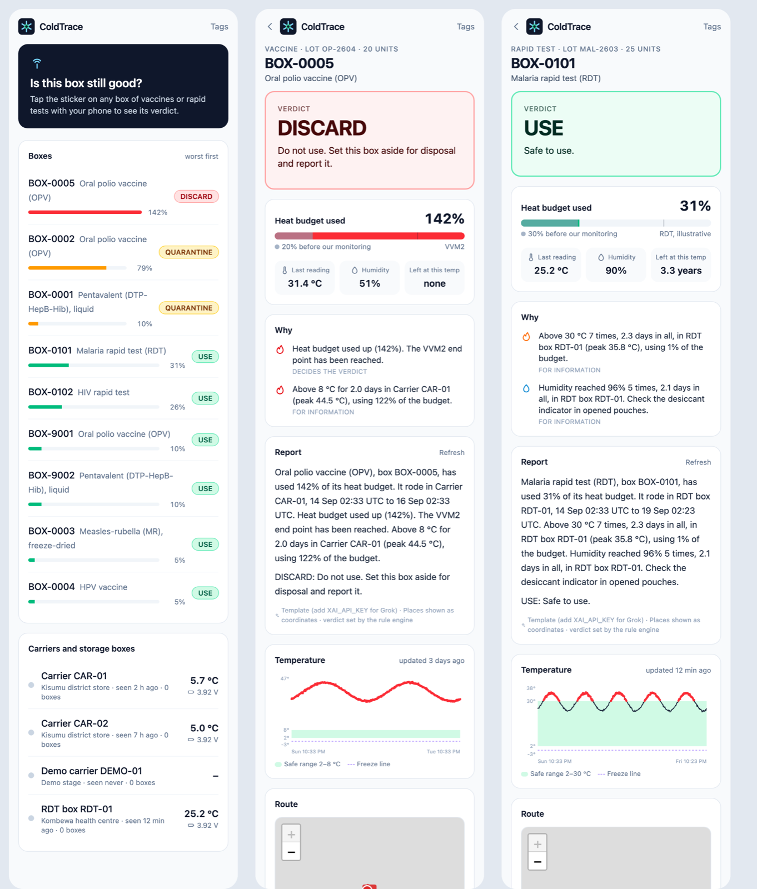
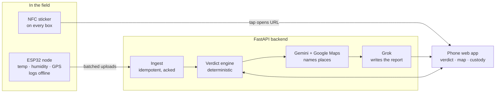
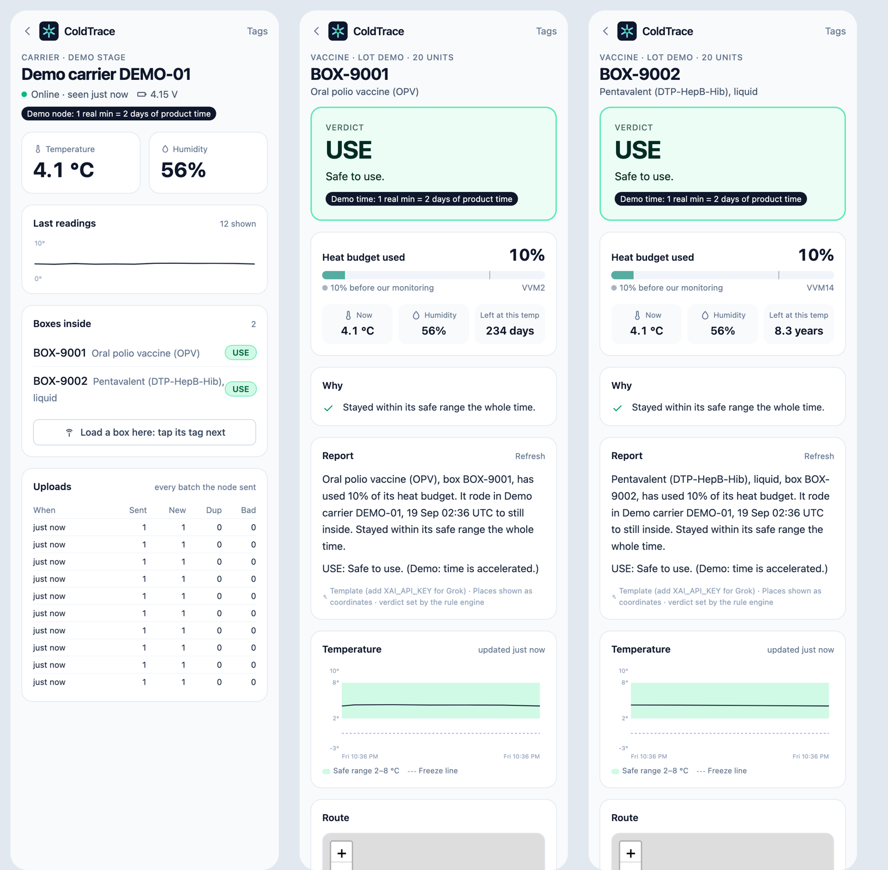
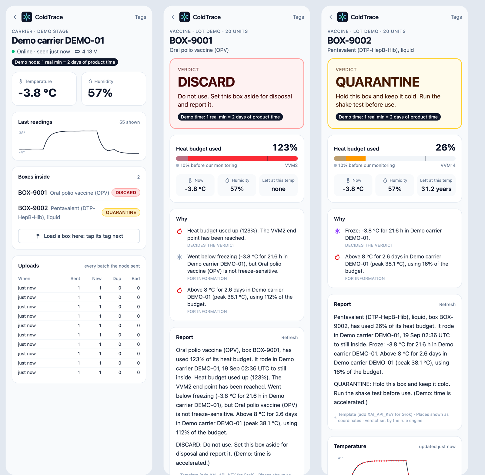

# ColdTrace

**Last-mile cold chain monitor for vaccines and rapid diagnostic tests.**

> Today's cold chain goes blind on the last mile and doesn't monitor rapid tests at all.
> We cover both, and tell the health worker whether this box is still good.

Two stretches of the chain have no monitoring today: the district-store-to-clinic
trip, and outreach carriers. Rapid tests aren't monitored anywhere.

ColdTrace puts a cheap, battery-powered ESP32 node (temperature, humidity, GPS)
inside the carrier. Every box gets an NFC sticker. A health worker taps the box
and gets **USE / QUARANTINE / DISCARD** for *that product*, worked out from
everything the box has been through.



## How it works



1. **The node logs continuously, even offline.** Readings queue in flash and
   leave only when the server acks them. Resending is always safe because each
   reading is keyed on `(node, boot, seq)`.
2. **Taps link boxes to nodes.** Tap a carrier's sticker, then a box's (either
   order, within 2 minutes), and the box is now "in" that carrier. Loading it
   into another carrier is a transfer. Each link is a custody segment.
3. **The engine stitches the box's history** across every carrier it rode in,
   then integrates the product's degradation rate over time:

   $$B = B_0 + \sum_i \frac{\Delta t_i}{t_{\text{life}}(T_i)}$$

   `t_life(T)` comes from a two-point Arrhenius fit through the product's WHO
   vaccine vial monitor (VVM) category. So `B` tracks how far the VVM on the
   vial has moved. `B_0` is budget used before our monitoring.
4. **Rules decide the verdict.** The same history always gives the same answer.
5. **AI only explains.** Gemini (with Google Maps grounding) turns GPS points
   into place names. Grok turns the engine's facts into a 90-word report for the
   worker. Neither can change the verdict. Both are cached, time out, and fall
   back to plain text.

### Verdict rules

| Verdict | When | What the worker does |
| --- | --- | --- |
| DISCARD | Budget used ≥ 100% (VVM end point reached) | Set aside, report |
| QUARANTINE | Freeze-sensitive product ≤ -0.5 °C for ≥ 60 min (WHO alarm) | Shake test (vaccines) / positive control (RDTs) |
| QUARANTINE | Budget used ≥ 75% | Check each vial's VVM |
| QUARANTINE | Hole in the history > 60 min, or node silent > 60 min | Supervisor reviews the record |
| USE | Otherwise (≥ 50%: "use this box first") | Use it |

Heat excursions, WHO heat alarms (≥ 8 °C for 10 h), freezes of
non-sensitive products and humidity (rapid tests, ≥ 75% RH for 6 h) are shown
as advisories. They don't change the verdict by themselves, because the budget
already accounts for the heat.

Products seeded (`backend/app/engine/profiles.py`):
- **OPV**: VVM2
- **Measles-rubella**: VVM14
- **Pentavalent**: VVM14, freeze-sensitive
- **HPV**: VVM30, freeze-sensitive
- **Malaria and HIV rapid tests**: an illustrative curve anchored at the 24-month label shelf life at 30 °C and the WHO stress test of 60 days at 45 °C.

## The stage demo

Two boxes go in the same demo carrier. On `DEMO-01`, one real minute counts as
two days of product time, and the UI says so.




Heat the carrier and the OPV box goes to DISCARD. Freeze it and the pentavalent
box goes to QUARANTINE with "run the shake test". Same carrier, different
verdicts, because the verdict is product-specific. Full script:
[docs/demo.md](docs/demo.md).

## Repo

| Folder | What lives there |
| --- | --- |
| [`backend/`](backend) | FastAPI API, verdict engine, Gemini/Grok services, node simulator, tests |
| [`web/`](web) | Phone web app (React + Vite + Tailwind + Leaflet) |
| [`firmware/`](firmware) | ESP32 node skeleton (PlatformIO): SHT31, GPS, deep sleep, flash queue |
| [`docs/`](docs) | Demo script, screenshots |

## Run it locally

Needs Python 3.11+ and Node 22.

```bash
cd backend
uv venv && uv pip install -r requirements-dev.txt
cp ../.env.example .env            # add GEMINI_API_KEY / XAI_API_KEY if you have them
.venv/bin/uvicorn app.main:app --reload --port 8000
```

A fresh database seeds demo carriers, boxes and a few days of trips. Then:

```bash
cd web && npm install && npm run dev      # http://localhost:5173
```

Pretend to be a node. Type `h` heat, `f` freeze, `n` normal, `o` offline, then Enter:

```bash
cd backend && .venv/bin/python -m simulator.sim_node --node DEMO-01
```

Tests (engine, ingest, custody, AI fallbacks, demo stories):

```bash
cd backend && .venv/bin/python -m pytest
```

Add `TEST_DATABASE_URL=postgresql://...` to run the same suite on Postgres.
Reset the demo data with `python -m simulator.backfill --reset`.

## Deploy (Render)

`render.yaml` defines one Docker web service plus Postgres. FastAPI serves both
the API and the built web app, so NFC stickers, nodes and phones all use one
HTTPS domain.

1. Render: **New > Blueprint** and pick this repo.
2. Set `GEMINI_API_KEY` and `XAI_API_KEY`. Note the generated `NODE_KEY` for the firmware.
3. Write the NFC stickers only once the domain is final. The `/tags` page lists each URL.

The starter instance is on purpose: free instances sleep and take about a minute to wake.

## API

| Method | Path | |
| --- | --- | --- |
| POST | `/api/ingest/readings` | Node uploads (header `X-Node-Key`); returns `ack_seq`, `server_time` |
| GET | `/api/boxes` | Every box with its verdict |
| GET | `/api/boxes/{id}/report` | Verdict, budget, reasons, legs, route, series |
| POST | `/api/boxes/{id}/explain` | Gemini place names + Grok report |
| POST | `/api/boxes/{id}/load` / `unload` | Custody changes |
| GET | `/api/nodes`, `/api/nodes/{id}` | Node status, readings, upload log |
| GET | `/api/products` | Stability profiles |

## Assumptions and limits

- Time between custody segments (e.g. in a clinic fridge with its own logger)
  is treated as covered by existing monitoring.
- Rapid-test stability curves are illustrative until we have manufacturer data.
- The VVM category for pentavalent depends on the manufacturer (VVM7 or VVM14).
- A clinic with no signal gets the verdict at the next sync. An on-node verdict LED is next.
