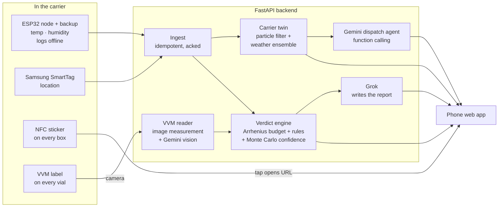
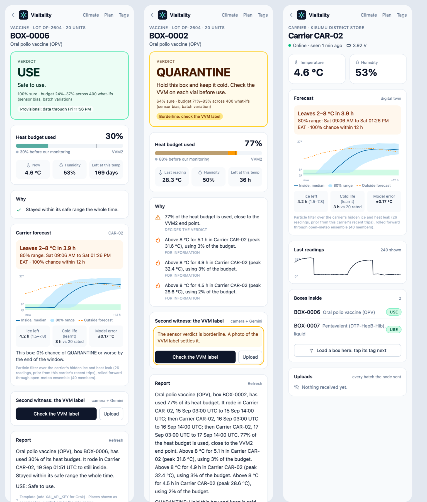
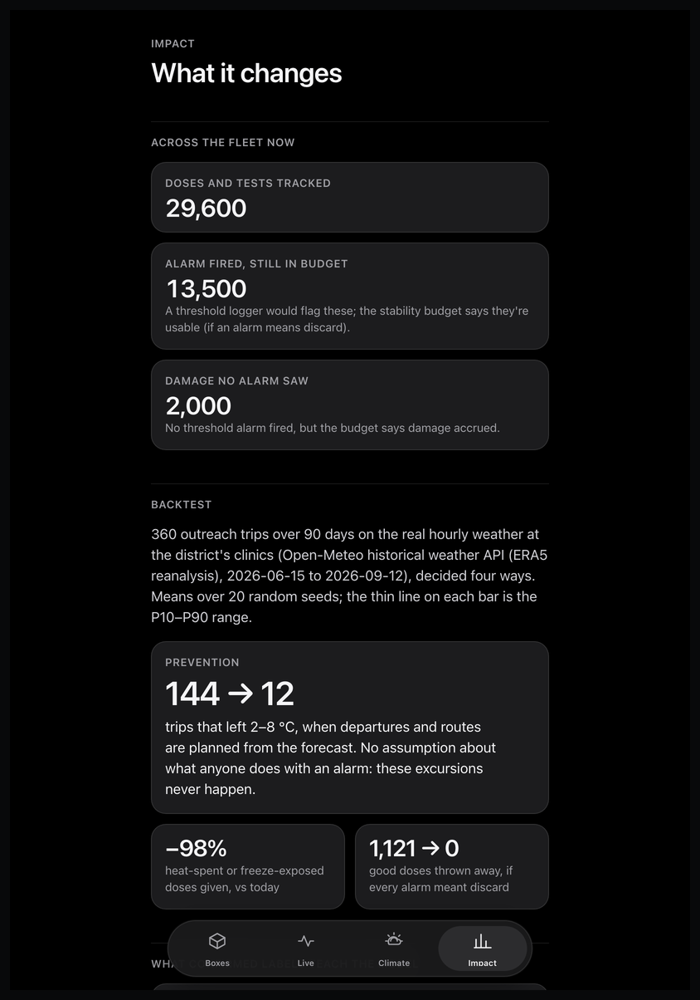
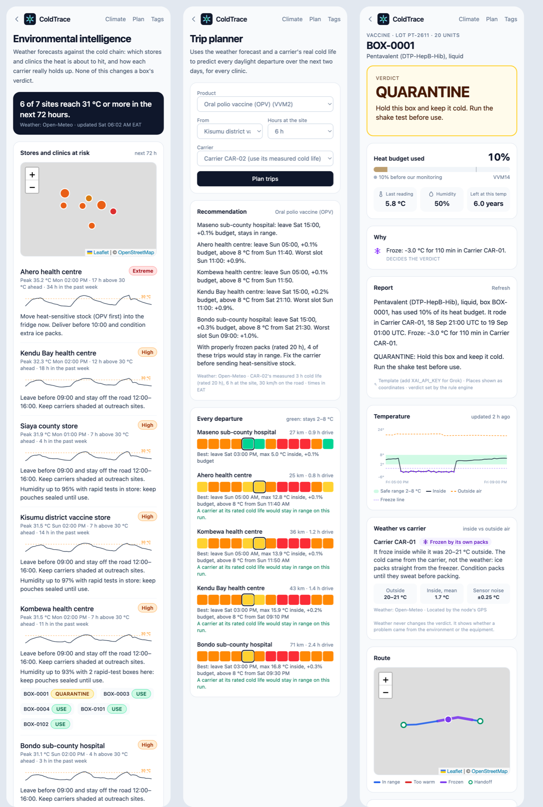

# SecuriVax

**Is this vial still good? A last-mile cold chain monitor for vaccines and rapid tests.**

HopHacks 2026 · Healthcare track

> On outreach, the vaccine vial monitor (VVM) is often the only monitor. The color of the VVM is assessed by the human eye, and is subject to misinterpretation.

> Rapid tests have no monitor at all. We tell the health worker whether this box is still good.

The weakest stretch is the outreach carrier. UNICEF recommends electronic freeze
indicators for cold boxes and fridges have 30-day loggers, but a freeze indicator
gives one pass/fail for the whole trip, and a VVM shows heat exposure but not freezing.
We say when and where it happened, and give a verdict for the product's viability in each box.

SecuriVax puts a economical, battery-powered ESP32 node (temperature + humidity)
inside the carrier, plus a Samsung SmartTag for location. Every vaccine box gets an
NFC sticker. A health worker taps the box and gets **USE / QUARANTINE /
DISCARD** for *that product*, worked out from everything the box has been
through.

What makes it more than a logger:

- **A digital twin of every carrier.** A particle filter estimates how much ice
  the carrier has left and how fast it leaks. It learns each carrier's real cold
  life from past trips, then forecasts through a 40-member weather ensemble when
  the carrier will leave 2–8 °C, with an 80% range.
- **Two witnesses.** The phone camera measures the vial's own VVM label and
  cross-checks it against the sensor record. A worker confirms before it counts.
- **Honest confidence.** Every verdict is re-run 400 times over sensor bias and
  batch-to-batch variation: "holds in 90% of scenarios", not a calibrated
  probability. Borderline ones send the worker to the label.
- **It learns.** Every confirmed VVM photo is a real-world check of how fast a
  product degrades; the model speeds up a product that proves faster at once,
  and relaxes only on strong evidence.
- **A dispatch agent.** Gemini calls our own tools (carrier status, nearby
  fridges, chance of breaching before arrival) and recommends continue, divert
  or hold. A supervisor accepts it.
- **Measured impact.** A 90-day backtest on real ERA5 weather: planning trips
  from the forecast cuts trips that leave 2–8 °C from 144 to 12. Heat-spent or
  freeze-exposed doses given fall 98% versus today (freeze-exposed, not proven
  damaged: chilled vaccine often supercools).


## How it works



1. **The node logs continuously, even offline.** Readings queue in flash and
   leave only when the server acks them. Resending is always safe because each
   reading is keyed on `(node, boot, seq)`.
2. **Taps link boxes to nodes.** Tap a carrier's sticker, then a box's (either
   order, within 2 minutes), and the box is now "in" that carrier. Loading it
   into another carrier is a transfer. Each link is a custody segment.
3. **The engine stitches the box's history** across every carrier it rode in,
   then integrates the product's degradation rate over time:

   $$B = B_0 + \sum_i \frac{\Delta t_i}{t_{\text{life}}(T_i)}$$

   `t_life(T)` comes from a two-point Arrhenius fit through the product's WHO
   vaccine vial monitor (VVM) category. So `B` tracks how far the VVM on the
   vial has moved. `B_0` is budget used before our monitoring. The same
   integral runs everywhere:
   - in every verdict;
   - on each of the 400 confidence samples;
   - along every forecast trajectory, for the chance a box reaches QUARANTINE;
   - in the trip planner;
   - over every simulated box in the backtest.

   The VVM camera measures the same quantity off the label (0 = fresh, 1 = end
   point), which is why the two witnesses can be compared directly.
4. **Rules decide the verdict.** The same history always gives the same answer.
5. **AI only explains.** Gemini (with Google Maps grounding) turns GPS points
   into place names. Grok turns the engine's facts into a 90-word report for the
   worker. Neither can change the verdict. Both are cached, time out, and fall
   back to plain text.

### Verdict rules

| Verdict | When | What the worker does |
| --- | --- | --- |
| DISCARD | Budget used ≥ 100% (VVM end point reached) | Set aside, report |
| QUARANTINE | Freeze-sensitive product ≤ -0.5 °C for ≥ 60 min (WHO alarm) | Shake test (vaccines) / positive control (RDTs) |
| QUARANTINE | Budget used ≥ 75% | Check each vial's VVM |
| QUARANTINE | Hole in the history > 60 min, or node silent > 60 min | Supervisor reviews the record |
| USE | Otherwise (≥ 50%: "use this box first") | Use it |

Heat excursions, WHO heat alarms (≥ 8 °C for 10 h), freezes of
non-sensitive products and humidity (rapid tests, ≥ 75% RH for 6 h) are shown
as advisories. They don't change the verdict by themselves, because the budget
already accounts for the heat.

Products seeded (`backend/app/engine/profiles.py`):
- **OPV**: VVM2
- **Measles-rubella**: VVM14
- **Pentavalent**: VVM14, freeze-sensitive
- **HPV**: VVM30, freeze-sensitive
- **Malaria and HIV rapid tests**: an illustrative curve anchored at the 24-month label shelf life at 30 °C and the WHO stress test of 60 days at 45 °C.

## The carrier twin



The inside of a carrier holds at the ice packs' temperature until the ice is
gone, then drifts toward the outside air, plus any heat from sun or a vehicle.
Ice, leak rate, pack temperature and heat gain can't be measured, so the
carrier's twin estimates them from the readings.

- **Particle filter.** A sequential Monte Carlo filter tracks 1,000 candidate
  carriers. It uses a Student-t likelihood (robust to one odd reading) and
  Liu–West resampling (so the cloud doesn't collapse). It reports *effective*
  cold life, ice divided by leak, because that ratio is the part the data can
  actually identify.
- **Prior from the carrier's own history.** Its last few trips set the starting
  estimate for the next one.
- **Validated on synthetic carriers with a known answer.** Cold life is
  recovered to about 5% mean error, and the model predicts each next reading to
  within about 0.2 °C.
- **Forecast.** It rolls forward through the 40-member Open-Meteo ensemble and
  reports:
  - when the carrier leaves 2–8 °C, with P10, P50 and P90 times;
  - each box's chance of reaching QUARANTINE.
- **Dispatch.** The same forecast feeds the dispatch agent: continue, or divert
  to the nearest fridge the carrier can reach in range.

## Impact



We ran 360 outreach trips over 90 days on the actual hourly ERA5 weather at the
district's clinics. Each trip includes the failures that happen in the field:
packs straight from the freezer, worn carriers, a carrier left in a hot
vehicle. The same trips were then decided four ways. Means over 20 seeds:

| | Damaged doses given | Good doses thrown away | Doses damaged at all | Trips out of 2–8 °C |
| --- | --- | --- | --- | --- |
| Today (VVM read by eye) | 1,699 | 4 | 1,700 | 144 |
| Alarm-only logger | 0 | 1,121 | 1,700 | 144 |
| SecuriVax | 192 | 0 | 1,700 | 144 |
| **SecuriVax + planning** | **36** | **0** | **368** | **12** |

In this climate, freezing does far more damage than heat. SecuriVax catches
it without throwing away freeze-proof OPV and MR.

Planning means the forecast's cool departure slot, repacking carriers once the
twin flags a short cold life, and the "packs too cold" warning at departure.
Together they stop most of the damage from happening at all.

Every assumption is listed on the `/impact` page and in
`backend/app/backtest/simulate.py`. This is a simulation on real weather, not a
field trial.

## How it's different

Existing cold-chain platforms, such as CryoTrace AI, sell dashboards and
threshold or "predictive" alerts to logistics teams. SecuriVax answers a
different question, for a different person:

| | Enterprise monitoring | SecuriVax |
| --- | --- | --- |
| For | Logistics and QA teams on dashboards | The health worker holding the box, on any phone |
| Answer | "Temperature left range" | USE / QUARANTINE / DISCARD for this product, from WHO VVM kinetics |
| Prediction | Trend alerts | Physics twin with hidden-state estimation and calibrated P10–P90 |
| Ground truth | Sensors only | Sensor record cross-checked against the vial's own VVM label |
| Where | Warehouses and trucks | Outreach carriers, where the VVM is often the only monitor, plus rapid tests |
| Setting | Connected, enterprise | Offline-first $10 nodes, SmartTag location, no app install |

## Environmental intelligence



Hourly weather from [Open-Meteo](https://open-meteo.com) (free, no key): the
past 7 days and the next 3, for every store, clinic and carrier position.
**Weather never changes a verdict.** The verdict comes from what the sensor
measured. Weather tells you *why*, and *what's coming*:

- **Weather vs carrier, for every leg.** Inside temperature against outside air
  separates the environment from the equipment. Each leg is classed as
  *protected* (in range through the heat), *followed the outside air* (ice
  packs ran out), *hotter than outside* (sun, closed vehicle, tin roof),
  *frozen by its own packs* (froze on a 22 °C day), or *mild*. A
  second-difference estimate of sensor noise (typically ±0.2 °C) shows the
  signal is clean data, not jitter.
- **Stores and clinics at risk** (`/climate`). Each site gets a 72 h peak, hours
  above 30 °C ahead and in the past week, a risk level, concrete actions, and
  the boxes sitting there.
- **Carriers: model vs reality.** A passive-carrier model (ice as a store of
  degree-hours, WHO-style rating at +43 °C) is replayed against each real trip.
  The fit gives the carrier's *effective* cold life. The demo data shows CAR-02
  holding 3 h against a rated 20 h: "freeze packs fully, check the lid seal".
- **Trip planner** (`/plan`). Every daylight departure over the next 48 h, for
  every clinic, is predicted from the forecast and the carrier's measured cold
  life. It gives the best slot, the time the carrier would leave the safe range,
  whether a properly packed carrier would fix it, and which boxes (least budget
  left) should go on the gentlest run.

Offline, a built-in climate model stands in, labelled "model" everywhere it's
used. It's never shown as observed weather.

## Location and redundancy

- **Samsung SmartTag** in the carrier gives location without a GPS module. It
  reaches us through Home Assistant ([docs/smarttag.md](docs/smarttag.md)),
  because Samsung has no official tag-location API. Positions are interpolated
  onto readings by time. A node GPS, if fitted, takes priority.
- **Two ESP32s per carrier.** The backup node's readings fill any silence from
  the primary, and when both report, disagreements over 2 °C are flagged.
- Hardware build for our parts: [docs/hardware.md](docs/hardware.md).

## The stage demo

Two boxes go in the same demo carrier. On `DEMO-01`, one real minute counts as
two days of product time, and the UI says so.


Heat the carrier and the OPV box goes to DISCARD. Freeze it and the pentavalent
box goes to QUARANTINE with "run the shake test". Same carrier, different
verdicts, because the verdict is product-specific. Full script:
[docs/demo.md](docs/demo.md).

## Repo

| Folder | What lives there |
| --- | --- |
| [`backend/`](backend) | FastAPI API, verdict engine, Gemini/Grok services, node simulator, tests |
| [`web/`](web) | Phone web app (React + Vite + Tailwind + Leaflet) |
| [`firmware/`](firmware) | ESP32 node skeleton (PlatformIO): SHT31, optional GPS, deep sleep, flash queue |
| [`docs/`](docs) | Demo script, hardware build, SmartTag bridge, screenshots |

## Run it locally

Needs Python 3.11+ and Node 22.

```bash
cd backend
uv venv && uv pip install -r requirements-dev.txt
cp ../.env.example .env            # add GEMINI_API_KEY / XAI_API_KEY if you have them
.venv/bin/uvicorn app.main:app --reload --timeout-graceful-shutdown 2 --port 8000
```

A fresh database seeds demo carriers, boxes and a few days of trips. Then:

```bash
cd web && npm install && npm run dev      # http://localhost:5173
```

Pretend to be a node. Type `h` heat, `f` freeze, `n` normal, `o` offline, then Enter:

```bash
cd backend && .venv/bin/python -m simulator.sim_node --node DEMO-01
```

Tests (engine, ingest, custody, AI fallbacks, demo stories):

```bash
cd backend && .venv/bin/python -m pytest
```

Add `TEST_DATABASE_URL=postgresql://...` to run the same suite on Postgres.
Reset the demo data with `python -m simulator.backfill --reset`.

Evals (8 suites: verdicts, confidence, carrier twin, VVM camera, camera vs
record cross-check, learning, ingest under a hostile link, API latency) check
each part against a target. Latest results: [docs/evals.md](docs/evals.md).

```bash
cd backend && .venv/bin/python -m evals.run            # full, writes docs/evals.md
cd backend && .venv/bin/python -m evals.run --quick vvm learning
```

## Deploy

Render, from the Blueprint [`render.yaml`](render.yaml): one Docker service
(FastAPI serves the API and the built web app, so stickers, nodes and phones
share one HTTPS domain) plus Postgres. Steps, secrets, a custom domain
and rehearsing against the live URL: [docs/deploy.md](docs/deploy.md).
`/api/health` shows what a deploy has configured (never the values).

## API

| Method | Path | |
| --- | --- | --- |
| POST | `/api/ingest/readings` | Node uploads (header `X-Node-Key`); returns `ack_seq`, `server_time`, and `live_until` / `live_sample_s` when someone asked to watch |
| POST | `/api/nodes/{id}/live` | Ask a low-power node to stream for 10 min from its next check-in (12 a day per node) |
| POST | `/api/boxes/{id}/checkpoint` | A driver's NFC tap on the way: where the box is, when, who (an operator) |
| POST | `/api/boxes/{id}/receive` | The clinic's QR scan: picked up, the trip ends (an operator); the report's `history` lists every event |
| GET | `/api/boxes` | Every box with its verdict |
| GET | `/api/boxes/{id}/report` | Verdict, budget, reasons, legs, route, series |
| POST | `/api/boxes/{id}/explain` | Gemini place names + Grok report |
| POST | `/api/boxes/{id}/load` / `unload` | Custody changes (an operator: signed in, or `X-Operator-Token`) |
| GET | `/api/nodes`, `/api/nodes/{id}` | Node status, readings, upload log |
| GET | `/api/products` | Stability profiles |
| POST | `/api/ingest/locations` | Tracker positions (SmartTag, phone, GPS) |
| GET | `/api/climate/stores` | 72 h heat risk per store/clinic |
| GET | `/api/climate/carriers` | Effective cold life per carrier (model vs reality) |
| POST | `/api/climate/plan` | Departure × destination predictions from the forecast |
| GET | `/api/nodes/{id}/forecast` | Carrier twin: state, forecast fan, breach time P10/P50/P90, per-box risk |
| POST | `/api/nodes/{id}/agent` | Gemini dispatch agent (rules fallback): continue / divert / hold, with its tool calls |
| POST | `/api/boxes/{id}/vvm` · `/vvm/{check}/confirm` | Camera VVM reading vs sensor; worker confirms |
| GET | `/api/impact` | 90-day ERA5 backtest results |
| GET | `/api/boxes/learning/summary` | What confirmed VVM photos have taught the model, per product |
| GET | `/api/health` | Liveness plus configuration (database, AI keys, weather, write protection, commit) |
| POST | `/api/auth/register` · `login` · `demo` · `logout`, GET `/api/auth/me` | Accounts: an HttpOnly signed cookie; the operator code at sign-up makes an operator, the demo is a viewer |
| POST | `/api/admin/reset-stage` | Stage demo back to the start (an operator) |
| POST | `/api/admin/reset-demo` | Re-seed the demo data with history ending now, keeping accounts (needs `OPERATOR_TOKEN` set) |

## Assumptions and limits

- Time between custody segments (e.g. in a clinic fridge with its own logger,
  or a box left on a table) is flagged as "unmonitored for X h" in the reasons
  and the chain of custody. It isn't counted as cold, and it doesn't hold the
  box on its own.
- The carrier twin has only been tested on simulated carriers. On physics it
  doesn't model (ice that warms as it melts, lid openings) it still saw 97% of
  breaches coming and warned early, but it overstates how likely a breach is.
  A real cooler run (predicted against actual breach time) is next.
- "Holds in N% of scenarios" is a robustness share over sensor bias, batch
  variation and the starting budget, not a calibrated probability.
- Rapid-test stability curves are illustrative until we have manufacturer data.
- The carrier model is deliberately simple (one ice store, one time constant).
  It's for ranking options and spotting bad carriers, not for verdicts.
- SmartTag positions depend on Galaxy phones passing by, so they're sparse in
  rural areas. Add a GPS module for continuous routes.
- The VVM category for pentavalent depends on the manufacturer (VVM7 or VVM14).
- A clinic with no signal gets the verdict at the next sync. An on-node verdict LED is next.
