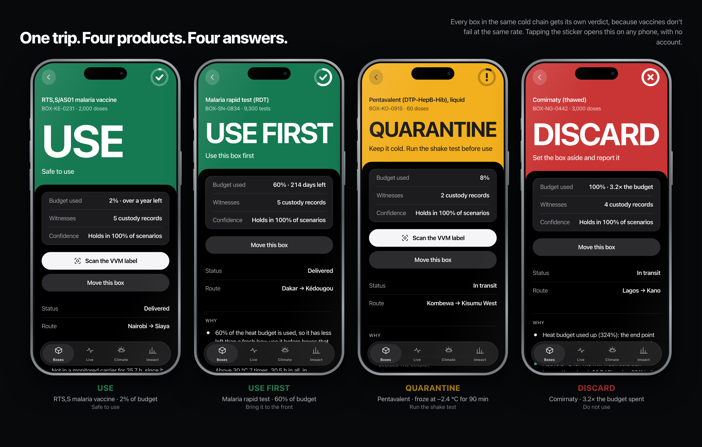
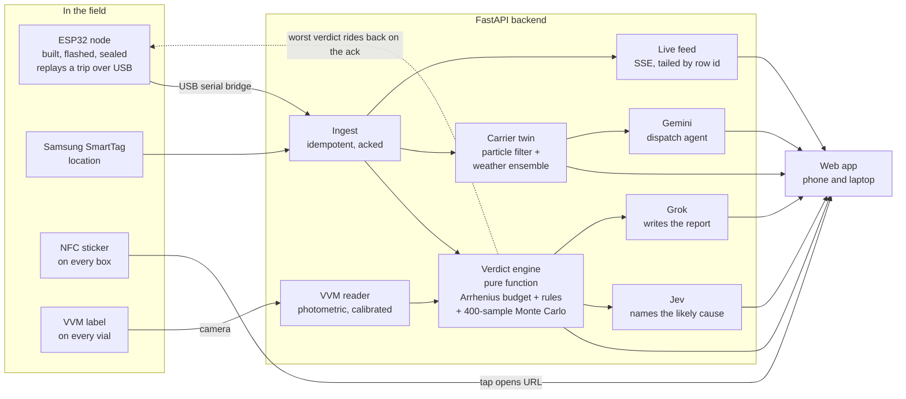
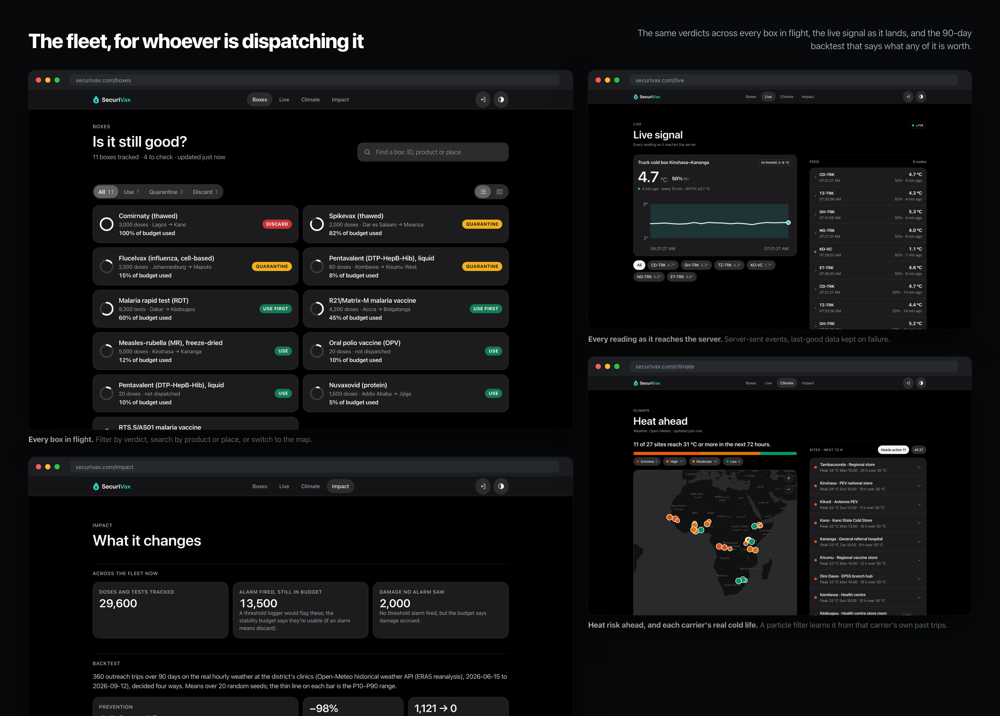

# SecuriVax

**Is this vial still good? A last-mile cold chain monitor for vaccines and rapid tests.**

HopHacks 2026 · Healthcare track

On outreach, the vaccine vial monitor (VVM) is often the only monitor a vial
carries, and its colour is read by eye — which makes it easy to misread. Rapid
tests carry no monitor at all. We tell the health worker whether the box in
front of them is still good.

The weakest stretch is the outreach carrier. UNICEF recommends electronic freeze
indicators for cold boxes and fridges have 30-day loggers, but a freeze indicator
gives one pass/fail for the whole trip, and a VVM shows heat exposure but not freezing.
We say when and where it happened, and give a verdict for the product's viability in each box.

SecuriVax puts an economical, battery-powered ESP32 node (temperature + humidity)
inside the carrier, plus a Samsung SmartTag for location. Every vaccine box gets an
NFC sticker. A health worker taps the box and gets **USE / QUARANTINE /
DISCARD** for *that product*, worked out from everything the box has been
through.

What makes it more than a logger:

- **A digital twin of every carrier.** A particle filter estimates how much ice
  the carrier has left and how fast it leaks. It learns each carrier's real cold
  life from past trips, then forecasts through a 40-member weather ensemble when
  the carrier will leave 2–8 °C, with an 80% range.
- **Two witnesses.** The phone camera measures the vial's own VVM label and
  cross-checks it against the sensor record. A worker confirms before it counts.
- **Honest confidence.** Every verdict is re-run 400 times over sensor bias and
  batch-to-batch variation: "holds in 90% of scenarios", not a calibrated
  probability. Borderline ones send the worker to the label.
- **It learns.** Every confirmed VVM photo is a real-world check of how fast a
  product degrades; the model speeds up a product that proves faster at once,
  and relaxes only on strong evidence.
- **A dispatch agent.** Gemini calls our own tools (carrier status, nearby
  fridges, chance of breaching before arrival) and recommends continue, divert
  or hold. A supervisor accepts it.
- **Measured impact.** A 90-day backtest on real ERA5 weather: planning trips
  from the forecast cuts trips that leave 2–8 °C from 144 to 12. Heat-spent or
  freeze-exposed doses given fall 98% versus today (freeze-exposed, not proven
  damaged: chilled vaccine often supercools).



One cold chain, four products, four answers. Tapping the sticker on a box opens
its verdict on any phone, with no account and nothing to install.

## How it works



One honest note before the detail. The node is built, flashed and sealed, but
its sensor never answered on the bench, so nothing in this repo has ever
measured a real temperature. The only hardware path into ingest today is the
`replay` build over USB serial
(`backend/scripts/serial_bridge.py`). Everything downstream of ingest — budget,
verdict, twin, live — is the real thing, and it is what the rest of this section
describes.

1. **The decision engine is a pure function.**
   `evaluate(profile, segments, now, initial_budget_used, label)` in
   [`backend/app/engine/verdict.py`](backend/app/engine/verdict.py) takes a
   history and returns a verdict. `now` is an argument, not a clock. Nothing in
   `backend/app/engine/` imports the database, the models or the services, so
   the engine physically cannot read or write a row. That is why the same
   history always gives the same answer, why 211 tests can pin it, and why the
   Monte Carlo can re-run it 400 times without a fixture.

2. **Readings arrive exactly once, or the node keeps them.** Each reading is
   keyed on `(node, boot, seq)` with a dialect-aware `ON CONFLICT DO NOTHING`,
   so a resend is harmless. One bad reading is rejected on its own rather than
   sinking the batch; a storage failure rolls back and returns 503 so the node
   retries. The ack carries `ack_seq`, `server_time`, `live_until` /
   `live_sample_s`, and `worst_verdict` — the worst verdict among the boxes in
   that carrier right now, for the node's status LED. `worst_verdict` is
   computed after the readings are committed and wrapped so it can never fail
   the upload: the ack is what matters
   ([`backend/app/routers/ingest.py:160`](backend/app/routers/ingest.py)).
   The ingest eval runs a simulated node over a link that drops 25% of
   requests, loses 20% of acks, reorders 10% of batches and reboots at random:
   100% of good readings stored, 0 rows stored twice, 0 sensor glitches stored,
   worst rebuilt timestamp off by 1 s.

3. **Taps link boxes to carriers.** Tap a carrier's sticker, then a box's
   (either order, within 2 minutes), and the box is now "in" that carrier.
   Loading it into another carrier is a transfer. Each link is a custody
   segment. Reading a sticker is public; *loading* needs an operator, so a tap
   by someone signed out keeps the half-finished pairing, sends them to sign in
   and completes the load when they come back
   ([`web/src/lib/tap.ts`](web/src/lib/tap.ts)).

4. **The engine stitches the box's history** across every carrier it rode in,
   then integrates the product's degradation rate over time:

   $$B = B_0 + \sum_i \frac{\Delta t_i}{t_{\text{life}}(T_i)}$$

   `t_life(T)` comes from a two-point Arrhenius fit through the product's
   stability anchor. So `B` tracks how far the vial's VVM has moved, for the
   products that carry one. `B_0` is budget used before our monitoring. One
   function, `integration_points()`, decides which points get integrated, and
   everything that integrates calls it:

   - every verdict;
   - each of the 400 confidence samples;
   - every forecast trajectory, for the chance a box reaches QUARANTINE;
   - the counterfactual at `GET /api/boxes/{id}/counterfactual`: the same
     history re-run through all twelve product profiles;
   - every simulated box in the backtest.

   That sharing is deliberate, and it is tested: with noise set to zero the
   Monte Carlo reproduces the engine's verdict in 100% of cases. Two
   independent implementations would disagree at the edges, and the confidence
   number would then be measuring the gap between two programs rather than
   uncertainty about the world.

5. **The engine knows which thermometer it read.** Every upload names its
   sensor. That name sets a one-sigma calibration error, and the error moves
   the freeze line: `freeze_guard(σ) = -0.5 + 1.645σ`, the warmest reading that
   could still be a true -0.5 °C at 95% one-sided confidence.

   | Sensor reported | Datasheet ± | σ | Freeze guard band |
   | --- | --- | --- | --- |
   | `sht31` | 0.2 °C | 0.20 | -0.17 °C |
   | `ds18b20` | 0.5 °C | 0.25 | -0.09 °C |
   | `dht22` | 0.5 °C | 0.25 | -0.09 °C |
   | `dht11` | 2.0 °C | 1.00 | +1.15 °C |
   | none reported | — | 0.20 | -0.17 °C (the design's SHT31) |

   The same σ widens the Monte Carlo's correlated bias draw, colours the live
   feed's bands, and — when a primary and a backup are merged — the leg is rated
   at whichever of the two sensors is coarser. A coarse sensor makes the system
   more cautious rather than quietly wrong, and the verdict says so in words:
   "within the DHT11 sensor's ±2 °C error of the freeze alarm (1.15 °C guard
   band)". The last row is worth reading twice: the replay build reports a
   sensor name the bridge deliberately does not recognise, so no sensor is
   uploaded and the stage demo's spread is the design SHT31's, not that of any
   part we have.
   ([`backend/app/engine/profiles.py:33-65`](backend/app/engine/profiles.py))

6. **Rules decide. AI only explains.** Three services run beside the engine,
   never inside it. Each is cached, has a timeout, and has a rules fallback
   that the app ships with.

   | Service | What it does | With no key, or on failure |
   | --- | --- | --- |
   | Gemini | GPS points to place names; a second opinion on a VVM photo; the dispatch agent's function calls | Coordinates; the camera's own reading; the agent's rules fallback |
   | Grok | Turns the engine's facts into a 90-word report for the worker | Plain text assembled from the same facts |
   | Jev (TypeSafe) | Names the likely cause of each leg — one of six, with a probability and a confidence | The rules' own cause, `source="rules"`, without a probability |

   `GET /api/health` reports all three side by side. Jev's client is built once
   per process with retries forced to zero: the SDK's default policy would fit
   one attempt in three under its own 30 s cap and hold a health worker's report
   for tens of seconds per leg. A cause is worth 1.5 seconds and not a second
   more, because the rules already have one
   ([`backend/app/services/jev.py:83-122`](backend/app/services/jev.py)).
   Rate limits are per endpoint and per client, plus a second cap on Gemini's
   total spend across all users — 60 calls an hour — because the dispatch agent
   is open to anyone, given it only advises
   ([`backend/app/security.py:38-73`](backend/app/security.py)).

### Two interfaces, one URL

The app chooses its interaction model from the pointer type, not the window
width. On a phone it is NFC taps, a camera and a QR scan. On a laptop whole
components branch: a glass top bar with the sections centred, sticky two-column
layouts, `/` to focus the search and Enter to open the matching box, a carrier
picker instead of a tap, drag-and-drop or the webcam for a VVM photo, and a QR
code that hands the current page to a phone — for the label scan it opens the
phone straight into the scanner with `?vvm=1`. `/stage` is a third view again, a
projector view, where the verdict word is measured and resized to run edge to
edge so both "USE" and "QUARANTINE" fill the panel from the back of a room.



One box or one carrier is public, because a health worker holding a box has no
account and neither does a judge scanning a sticker. Everything that browses the
fleet — the box list, live, climate, impact, the stickers, the stage — asks you
to sign in and returns you to where you were. The sign-up's operator code is
what makes an operator; leave it empty for a viewer.

# Testing & Demonstration

## One Trip. Four Products. Four Answers.

A single cold-chain journey does not necessarily mean every product experiences the same conditions.

SecuriVax evaluates each tracked product individually and turns its thermal history into an actionable status.

[View the four product cases image](https://github.com/SoumilBhandari/SecuriVax/blob/main/Hardware/image/cases.png?utm_source=chatgpt.com)


The system can distinguish between different outcomes:

| Product                        |     Status     | Action                                   |
| ------------------------------ | :------------: | ---------------------------------------- |
| **RTS,S/AS01 malaria vaccine** |     **USE**    | Safe to use                              |
| **Malaria rapid test (RDT)**   |  **USE FIRST** | Bring this box to the front              |
| **Pentavalent vaccine**        | **QUARANTINE** | Keep cold and perform the required check |
| **Comirnaty (thawed)**         |   **DISCARD**  | Set the box aside and report it          |

This is the core idea behind SecuriVax: **products do not receive one blanket decision simply because they traveled together. Each product gets its own status based on its recorded history.**

---

## Physical Demonstration: Two Different Outcomes

We also tested the physical workflow using two different cases.

### Case 1 — Discard

In the first test, the product experiences conditions that push its thermal exposure beyond the acceptable limit.

SecuriVax identifies the problem and produces a clear action:

|                                                   **Case 1 — Discard**                                                   |                                               **Case 2 — Safe to Use**                                               |
| :----------------------------------------------------------------------------------------------------------------------: | :------------------------------------------------------------------------------------------------------------------: |
|  |  |
|                 **DISCARD** — The recorded thermal history indicates that the product should not be used.                |                      **USE** — The recorded thermal history remains within the acceptable range.                     |
|                               **Action:** Do not use. Set the product aside and report it.                               |                                               **Action:** Safe to use.                                               |


---

## Why the Two Cases Matter

The two demonstrations show that SecuriVax is not simply displaying a temperature reading.

The same monitoring workflow can lead to **different actions depending on what the individual product experienced**:

```text
                    Product
                       ↓
                NFC Identification
                       ↓
               Environmental Data
                       ↓
                Thermal History
                       ↓
                  Analysis
                       ↓
             ┌─────────┴─────────┐
             ↓                   ↓
       Within limits        Beyond limits
             ↓                   ↓
            USE                DISCARD
```

This allows the system to move from:

> **"What is the temperature?"**

to:

> **"What happened to this product, and what should I do now?"**

The four-case demonstration extends this idea further by showing that different products can receive different decisions — **USE, USE FIRST, QUARANTINE, or DISCARD** — even when they are part of the same overall cold-chain journey.

## Hardware

SecuriVax is designed as a small, serviceable monitoring node that can live
inside a vaccine carrier or rapid-test storage box. The hardware documentation
is kept in [Hardware/](Hardware/) and is organized around two revisions so that
someone else can build, wire, test, and duplicate the project.

### Prototype 101: the event validation build

Prototype 101 is the removable bench prototype used to validate the sensing and
identification concept before committing to a custom PCB. It contains:

- ESP32 DevKit WROOM-1 controller
- RC522 13.56 MHz RFID reader over SPI
- Two DHT11 sensors for independent temperature and humidity observations
- Solderable prototype board, female headers, jumper wires, and USB access

The two DHT11 data lines are independent: sensor 1 uses GPIO 4 and sensor 2
uses GPIO 13. The RC522 uses GPIO 18/23/19 for SPI clock/MOSI/MISO, GPIO 5 for
chip select, and GPIO 22 for reset. All modules use 3.3 V logic and a common
ground. The complete component and protocol table is in the
[Prototype 101 schematic](Hardware/prototype%20101/schematics/README.md), with
the [Prototype 101 BOM](<Hardware/prototype%20101/BOM(Bill%20of%20material)/README.md>)
and [CAD guide](Hardware/prototype%20101/cad/README.md) beside it.

This was the version we could physically assemble during the 36-hour event:
the lab did not have enough of the required production materials to fabricate
the custom board and final enclosure in time. It is a functional validation
prototype, not the final hardware release.

### SecuriVax 102: the final hardware version

Revision 102 is the final hardware design. It consolidates the prototype into a
repeatable custom PCB and enclosure.
The board carries an ESP32-C3-WROOM-02-N4, DHT22, two buttons, USB-C,
AMS1117M-5.0RG regulation, a red status LED, passives, and an
ST25R3916 NFC/RFID reader with its antenna network. The 102 reader is a
different design from the 101 RC522, so its final bus, interrupt, reset, and
GPIO assignments are recorded against the PCB schematic rather than copied
from the prototype.


The enclosure is approximately 70 mm x 30 mm x 17 mm and is documented with
exploded, isometric, orthographic, cover, base, PCB, and dimension drawings.
The current STL exports are kept in [Hardware/STL/](Hardware/STL/), while the
[102 CAD guide](<Hardware/SecuriVax%20(102)/cad/README.md>) explains the model,
assembly order, print settings, and how to identify the two exported parts.

See the [102 BOM](<Hardware/SecuriVax%20(102)/BOM(Bill%20of%20material)/README.md>)
and [102 schematic](<Hardware/SecuriVax%20(102)/schematics/README.md>) for the
component images, PCB roles, power rails, protocol table, and final pin record.
The current 102 net map records GPIO 2 for DHT22 data, GPIO 0/1 for the two
buttons, GPIO 3 for the status LED, and GPIO 4/5/6/10 for NFC clock/data/chip
select/reset.

### Firmware and hardware boundary

The PlatformIO firmware supports the node's low-power sensing workflow:

1. Read temperature, humidity, and battery voltage.
2. Store readings in a LittleFS queue while offline.
3. Upload batches only after Wi-Fi is available and the server acknowledges them.
4. Deep-sleep between battery samples, with a demo build that stays awake for
   rapid presentation feedback.

The current firmware pin convention for the classic ESP32 DevKit is GPIO 4 for
the primary DHT data line, GPIO 13 for the optional second sensor or DS18B20
probe, GPIO 21/22 for an SHT31 I2C bus, GPIO 16/17 for optional GPS serial, and
GPIO 35 for battery measurement. The 102 PCB uses its own recorded ESP32-C3
net map above. Firmware build and wiring details are in
[firmware/README.md](firmware/README.md); the 102 pin rows remain subject to
bench verification before production firmware is locked.
### Verdict rules

There are four verdicts, not three. `USE_FIRST` is its own value: it is returned
verbatim in the `verdict` field of `/api/boxes`, `/api/boxes/{id}/report` and
`/api/boxes/fleet/summary`, and counted as its own bucket in the fleet counts.

| Verdict | When | What the worker does |
| --- | --- | --- |
| DISCARD | Budget used ≥ 100% | Set aside, report |
| DISCARD | A confirmed VVM photo at its discard point, whatever the budget says | Set aside, report |
| QUARANTINE | Budget used ≥ 75% | Check the VVM on each vial; or, for a vaccine with no VVM, have a supervisor clear it; or, for a rapid test, run a positive control |
| QUARANTINE | A confirmed VVM photo ≥ 75% while the sensor budget is below 75% | Compare every vial's VVM before use |
| QUARANTINE | Freeze-sensitive product ≤ -0.5 °C for ≥ 60 min (WHO alarm) | The product's own freeze check: shake test, positive control, or "do not use: never refreeze" |
| QUARANTINE | Freeze-sensitive product at or below the reporting sensor's guard band for ≥ 60 min | The same freeze check |
| QUARANTINE | Hole in the history > 60 min, or node silent > 60 min | Supervisor reviews the record |
| USE FIRST | Budget used ≥ 40% | Use it at the next session; don't re-dispatch it or keep it in reserve |
| USE | Otherwise | Use it |


The guard-band row is the one that matters on cheap hardware. A box that never
read ≤ -0.5 °C but sat in the band for an hour is still held, because at that
sensor's error we cannot say it did not freeze. On the design SHT31 that band is
-0.17 °C; on the DHT11 actually wired to the bench it is +1.15 °C.

The action text follows the product, not a template. The engine only says "check
the VVM" when the product has one: six of the twelve seeded products do not, and
for those it asks for a supervisor or a positive control instead.

Heat excursions, WHO heat alarms (≥ 8 °C for 10 h), freezes of non-sensitive
products, unconditioned ice packs, backup fill-in, sensor disagreement and
humidity (rapid tests, ≥ 75% RH for 6 h) are advisories. They don't change the
verdict by themselves, because the budget already accounts for the heat.
Budget past 100% displays as `100% · 2.4× the budget`: the integral keeps
running, the bar does not.

Every box also reports mean kinetic temperature to the USP &lt;1079&gt;
definition (activation energy 83.144 kJ/mol), peak temperature, peak humidity
and hours outside the labelled range — computed over exactly the points the
budget integrates, so the summary can never quietly disagree with the decision.
`mkt_c` is on every box in the list view.

**Products seeded** ([`backend/app/engine/profiles.py`](backend/app/engine/profiles.py)).
Twelve profiles, four of them anchored on label storage claims or a
VVM-equivalent assumption rather than a WHO VVM category. Vaccines are labelled
2–8 °C, rapid tests 2–30 °C.

| Product | Stability anchor | VVM on the vial | Freeze-sensitive | If it froze |
| --- | --- | --- | --- | --- |
| Oral polio (OPV) | VVM2 | yes | no | — |
| Measles-rubella, freeze-dried | VVM14 | yes | no | — |
| Pentavalent (DTP-HepB-Hib), liquid | VVM14 | yes | yes | Run the shake test |
| HPV | VVM30 | yes | yes | Run the shake test |
| R21/Matrix-M malaria | VVM14 (assumed) | yes | yes | Run the shake test |
| RTS,S/AS01 malaria | VVM14 (assumed) | yes | yes | Run the shake test |
| Nuvaxovid (protein) | VVM7-equivalent, illustrative | no | yes | Run the shake test |
| Flucelvax (cell-based flu) | VVM7-equivalent, illustrative | no | yes | Run the shake test |
| Comirnaty (thawed) | Label claims, illustrative | no | yes | Do not use: never refreeze |
| Spikevax (thawed) | Label claims, illustrative | no | yes | Do not use: never refreeze |
| Malaria rapid test | 24-month label shelf life at 30 °C, WHO stress test 60 days at 45 °C | no | yes | Run a positive control |
| HIV rapid test | The same illustrative curve | no | yes | Run a positive control |

**Every box argues with a threshold logger.** The same record is run through what
a WHO 30-day recorder would have concluded — 10 h continuously above the
labelled maximum, or 60 min at or below -0.5 °C, and alarm-only practice is to
discard — and the two answers are compared on the spot: SAVED ("a threshold
logger would condemn this box; its stability budget says it survived"), CAUGHT
("no threshold alarm would have fired, but damage accrued anyway") or AGREE,
including the case where both flag it but the logger means discard and SecuriVax
holds it for a check. `GET /api/boxes/fleet/summary` totals those outcomes in
doses, as `saved_from_needless_discard` and `silent_failures_caught`. The
argument the Impact table makes over 90 simulated days is made again, per box,
on whatever data is in front of you.

## The carrier twin


The inside of a carrier holds at the ice packs' temperature until the ice is
gone, then drifts toward the outside air, plus any heat from sun or a vehicle.
Ice, leak rate, pack temperature and heat gain can't be measured, so the
carrier's twin estimates them from the readings.

- **Particle filter.** A sequential Monte Carlo filter tracks 1,000 candidate
  carriers, with a Student-t likelihood (robust to one odd reading) and
  Liu–West resampling (so the cloud doesn't collapse). It reports *effective*
  cold life — ice divided by leak — because that ratio is the part the data can
  actually identify.
- **Empirical-Bayes priors, three deep.** A carrier with a track record is
  primed with the median effective cold life of its own last few finished trips
  (log-sd 0.35). A carrier with none falls back to the median across the whole
  fleet, at a deliberately wider spread (log-sd 1.0). With neither, a wide
  default. The answer says which it used, in words, on the page:
  `prior.from` is "this carrier's recent trips", "the fleet's trips (no history
  for this carrier)" or "a wide default". Demo-time trips are excluded from both
  records — accelerated time is not a real cold life.
- **Forecast.** It rolls forward through a weather ensemble and reports when the
  carrier leaves 2–8 °C, with P10, P50 and P90 times, and each box's chance of
  reaching QUARANTINE. The ensemble is Open-Meteo's `icon_seamless` when it is
  reachable; the code accepts any ensemble with five or more members and reports
  the count it actually got. Offline, or when the endpoint fails, it runs a
  locally generated 24-member perturbed forecast with AR(1) error growth. The
  response's `weather_source` always names which one ran.
- **Dispatch.** The same forecast feeds the agent: continue, or divert to the
  nearest fridge the carrier can reach in range. The card shows its working —
  "Answered by Gemini · 3 tool calls", or "Answered by the fallback rules", with
  each step listed — and nothing happens until a supervisor presses "Accept and
  log", which records the decision for every box inside
  (`POST /api/nodes/{id}/decisions`).

Measured on synthetic carriers driven by real ERA5 weather
([`backend/evals/twin.py`](backend/evals/twin.py), numbers straight out of
[docs/evals.md](docs/evals.md)):

| | Measured | Target |
| --- | --- | --- |
| Cold life within 25%, finished trips | 100.0% | ≥ 80% |
| Median cold-life error | 4.3% | ≤ 15% |
| Median one-step tracking error | 0.286 °C | ≤ 0.4 °C |
| 80% interval coverage, known carrier | 86.4% | ≥ 70% |
| 80% interval coverage, new carrier (fleet prior) | 86.4% | ≥ 70% |
| Calibration error, known carrier | 6.9% | ≤ 10% |
| Median P50 breach-time error, known carrier | 1 h | ≤ 1.5 h |
| Brier skill vs base rate, known carrier | 0.694 | ≥ 0.5 |
| Brier skill, new carrier (fleet prior) | -0.008 | context |
| Brier skill, no prior at all | -0.119 | context |

The last three rows are why the priors exist: a carrier's own history is what
makes the forecast sharp, the fleet prior keeps a new carrier calibrated but not
yet sharp, and with no prior the forecast is worse than the base rate.

**We also attacked it.** A second simulator builds carriers from physics the
twin explicitly does not model: an ice plateau that creeps from 3 to 6 °C as the
ice melts instead of holding flat, heat entering in proportion to
(outside − inside) through the walls, and the lid opened every 40–120 minutes for
a spike of a few degrees that costs ice. The twin is then run unchanged, with
only a fleet prior, and the results are reported as they came out:

| Against physics it doesn't model | Measured |
| --- | --- |
| Breaches it didn't see coming (breach within 12 h, forecast under 50%) | 2.8% |
| P50 breach time minus truth, median | -0.83 h — it warns early, the safe side |
| 80% interval coverage | 58.5% |
| Calibration error | 19.3% — it over-predicts breaches |
| Median one-step tracking error | 0.612 °C — lid spikes it can't predict |

## Impact


We ran 360 outreach trips over 90 days on the actual hourly ERA5 weather at the
district's clinics. Each trip includes the failures that happen in the field:
packs straight from the freezer, worn carriers, a carrier left in a hot
vehicle. The same trips were then decided four ways. Means over 20 seeds:

| | Damaged doses given | Good doses thrown away | Doses damaged at all | Trips out of 2–8 °C |
| --- | --- | --- | --- | --- |
| Today (VVM read by eye) | 1,699 | 4 | 1,700 | 144 |
| Alarm-only logger | 0 | 1,121 | 1,700 | 144 |
| SecuriVax | 192 | 0 | 1,700 | 144 |
| **SecuriVax + planning** | **36** | **0** | **368** | **12** |

In this climate, freezing does far more damage than heat. SecuriVax catches
it without throwing away freeze-proof OPV and MR.

Planning means the forecast's cool departure slot, repacking carriers once the
twin flags a short cold life, and the "packs too cold" warning at departure.
Together they stop most of the damage from happening at all.

Every assumption is listed on the `/impact` page and in
`backend/app/backtest/simulate.py`. This is a simulation on real weather, not a
field trial.

## How it's different

Existing cold-chain platforms, such as CryoTrace AI, sell dashboards and
threshold or "predictive" alerts to logistics teams. SecuriVax answers a
different question, for a different person:

| | Enterprise monitoring | SecuriVax |
| --- | --- | --- |
| For | Logistics and QA teams on dashboards | The health worker holding the box, on any phone |
| Answer | "Temperature left range" | USE / QUARANTINE / DISCARD for this product, from WHO VVM kinetics |
| Prediction | Trend alerts | Physics twin with hidden-state estimation and calibrated P10–P90 |
| Ground truth | Sensors only | Sensor record cross-checked against the vial's own VVM label |
| Where | Warehouses and trucks | Outreach carriers, where the VVM is often the only monitor, plus rapid tests |
| Setting | Connected, enterprise | Offline-first nodes from commodity parts, SmartTag location, no app install |

## Environmental intelligence


Hourly weather from [Open-Meteo](https://open-meteo.com) (free, no key): the
past 7 days and the next 3, for every store, clinic and carrier position.
**Weather never changes a verdict.** The verdict comes from what the sensor
measured. Weather tells you *why*, and *what's coming*:

- **Weather vs carrier, for every leg.** Inside temperature against outside air
  separates the environment from the equipment. Each leg is classed as
  *protected* (in range through the heat), *followed the outside air* (ice packs
  ran out), *hotter than outside* (sun, closed vehicle, tin roof), *frozen by its
  own packs* (froze on a 22 °C day), or *mild*. A second-difference estimate of
  sensor noise (typically ±0.2 °C) shows the signal is clean data, not jitter.
  Jev then names the leg's likely cause from those numbers, with a probability;
  its calibration is scored against the backtest, which knows the true cause
  because it constructed the trip. With no key the rules answered every leg and
  named the true cause 95.4% of the time on 326 scored trips, declining the 34
  where two things went wrong at once.
- **Trip conditions, clustered in the browser.** Every reading becomes a dot on
  three real axes — inside temperature, outside temperature, hours into the trip
  — drawn as a rotatable 3-D point cloud on a hand-written canvas renderer with
  no chart library. The readings are grouped by what the box was going through
  (inside and outside temperature, humidity, rate of change, and whether the
  carrier was moving, from the tracker positions), with `k` chosen by silhouette
  score, seeded k-means++ from a fixed seed so the same trip always draws the
  same way, and a merge pass because k-means will happily split a steady trip at
  4.3 vs 4.6 °C — sensor noise, not a different thing that happened. The
  product's safe band is shaded on the floor and each group is costed in budget.
  Nothing here is written by a model
  ([`web/src/lib/embed.ts`](web/src/lib/embed.ts)).
- **Stores and clinics at risk** (`/climate`, behind a sign-in). Each site gets a
  72 h peak, hours above 30 °C ahead and in the past week, a risk level,
  concrete actions, and the boxes sitting there.
- **Carriers: model vs reality.** `GET /api/climate/carriers` replays each real
  trip. Where a leg has enough readings the particle-filter twin's fit is the
  answer, reported with its P10–P90 `cold_life_range_h` and `fit_rmse_c`; the
  simple degree-hour model (ice as a store of degree-hours, WHO-style rating at
  +43 °C) is kept beside it as a cross-check under `heuristic_cold_life_h`. The
  `how` field says which one you are looking at. A carrier holding a few hours
  against a rated 20 gets the plain advice: freeze the packs fully, check the
  lid seal.

Offline, a built-in climate model stands in, labelled "model" everywhere it's
used. It's never shown as observed weather.

## Location and redundancy

- **Samsung SmartTag** in the carrier gives location without a GPS module. It
  reaches us through Home Assistant ([docs/smarttag.md](docs/smarttag.md)),
  because Samsung has no official tag-location API. Positions are interpolated
  onto readings by time. A node GPS, if fitted, takes priority. In the field the
  phone does the rest with no extra hardware: a driver's NFC tap logs a
  checkpoint with GPS and names the facility if it is within 3 km, and the
  clinic's QR scan ends the trip with the clinic already picked. No location
  from that phone means "it'll be logged without one", not a failure.
- **Two sensors per carrier, and what that means on each side.** The server side
  is built and tested: backup readings fill any stretch where the primary said
  nothing; where both read within two minutes of each other the merge keeps the
  *more cautious* one — the reading further from 5 °C, so the warmer sensor
  counts when it's hot and the colder one when it's cold; the merged segment
  inherits the coarser of the two sensors' error for every downstream allowance;
  and a maximum disagreement above 2 °C raises an advisory, once at least three
  paired readings exist
  ([`backend/app/engine/redundancy.py`](backend/app/engine/redundancy.py)).
  The firmware's implemented redundancy is two DHT sensors on **one** board,
  posted as a second stream under `NODE_ID + "B"`, and a record only leaves flash
  once *both* streams have been acked, so a half-successful upload cannot lose
  the backup's half. A genuinely second board is a hot spare, because there was
  one good sensor between them. Neither ever read anything, so no backup fill and
  no disagreement has occurred outside the tests.
- **The node is designed to log offline, and the code for it exists.** Readings
  append to a fixed-size binary queue in LittleFS; acked records are dropped by
  writing a fresh file and renaming it over the old one, so a power cut
  mid-compaction cannot corrupt the queue; a v1 queue left by older firmware is
  dropped on upgrade because the record size changed; the cap is 20,000 records,
  about two weeks, and it says so when it drops. `boot_id` lives in NVS and
  increments only on a true power-on, so `(boot_id, seq)` is unique forever.
  With no RTC module, the clock is set from GPS satellite time or from
  `server_time` in an upload reply, and an offset learnt at the first sync
  back-dates every record sampled before the clock was known; a record that
  still cannot be dated ships `uptime_ms` and the server rebuilds its timestamp.
  A reading outside 2–8 °C forces an immediate check-in instead of waiting for
  the schedule. None of this has ever carried a measured reading.
- **Finding its own sensor, without crash-looping.** The node discovers whichever
  part is fitted — DS18B20, SHT31, DHT11/DHT22 — and with no pin configured it
  sweeps the free GPIOs. It cannot use the library's read to do that: that read
  bit-bangs with interrupts off, and on an empty pin the spin outlasts the
  interrupt watchdog and reboots the board. So it knocks first, interrupts on,
  every wait bounded at 250 µs, and only instantiates a driver if something
  answers. A pin the user configured is read straight, because a sensor with no
  external pull-up can be slow to rise and would fail the knock while reading
  perfectly. Pins found are cached in RTC memory, so a deep-sleep wake never
  searches again
  ([`firmware/src/main.cpp:118-212`](firmware/src/main.cpp), commit `935351a`).
- **Why the bench node is silent.** Three diagnostic firmwares produced the
  diagnosis rather than a shrug. `scan` sweeps every pin safe to drive for I2C
  parts, DS18B20s, DHTs and analog sensors; `i2cprobe` then talks to each
  candidate address in its own protocol, so an address that merely ACKs cannot
  masquerade as a sensor; `diag` watches two pins closely — rest voltage under
  each internal pull, every transition after the DHT start signal, a 40-bit
  decode. The result: 3 noise edges where a live DHT11 gives about 84, and rest
  voltages that drift between sweeps (1.81 V to 2.03 V). Only an unconnected pin
  drifts like that, because anything attached clamps it through its input
  protection. The data pins are electrically empty — a wiring fault, not a dead
  part.
- **Power, costed and not measured.** GPS sits behind a P-MOSFET load switch so
  it draws nothing between fixes; WiFi is batched at 100 readings per request,
  up to 10 batches a wake; the battery build samples every 5 minutes into flash
  and connects every third sample; the node reads its own voltage through a
  100k/100k divider. That works out at about 7 mAh a day, months on a 2000 mAh
  cell. It is a duty-cycle estimate. No node has ever run on a battery.
- Intended build and parts: [docs/hardware.md](docs/hardware.md), which is a
  build guide for the SHT31 we specified, not for the DHT11s on the bench. What
  actually happened is in
  [the sensor that never answered](docs/hardware.md#the-sensor-that-never-answered).

## The stage demo

Two boxes go in the same demo carrier. On `DEMO-01`, one real minute counts as
two days of product time, and the UI says so. Heat the carrier and the OPV box
goes to DISCARD; freeze it and the pentavalent box goes to QUARANTINE with "run
the shake test". Same carrier, same trip, different verdicts, because the
verdict is product-specific.

That script needs a node with a working sensor, and ours never answered
([docs/hardware.md](docs/hardware.md#the-sensor-that-never-answered)). The node
runs `pio run -e replay` instead: a scripted trip over serial, stepped through
on the BOOT button, with nothing presented as measured. Everything downstream of
it — ingest, budget, verdict, live — is the real thing.

Scripts: [docs/demo.md](docs/demo.md) for the stage, or
[docs/walkthrough.md](docs/walkthrough.md) for the five-minute website tour,
which is what works today.

## Team

Built at HopHacks 2026 over the 36 hours, by four people:

| | |
| --- | --- |
| **Soumil Bhandari** | [@SoumilBhandari](https://github.com/SoumilBhandari) |
| **TAIDI LAAMIRI Taha** | [@DexterTaha](https://github.com/DexterTaha) |
| **Ye Yint Phone Pyae** | [@yyppyae](https://github.com/yyppyae) |
| **Avery Wu** | [@clemencecoco](https://github.com/clemencecoco) |

Every commit in this repo was made inside the event window: the first is
Friday 22:11, the last is Sunday morning. No code was carried in.

## Repo

| Folder | What lives there |
| --- | --- |
| [`backend/`](backend) | FastAPI API, the verdict engine, the AI services, the lane simulator, the backtest, 211 tests |
| [`web/`](web) | The phone web app and the landing story (React, Vite, Tailwind, three.js, Leaflet) |
| [`firmware/`](firmware) | The ESP32 node (PlatformIO): six builds, from the battery node to the bench diagnostics |
| [`Hardware/`](Hardware) | Enclosure CAD and the bill of materials |
| [`docs/`](docs) | [Architecture](docs/architecture.md), the demo script, the hardware build, evals, deploy |
| `vvm-photos/` | Where a scanned VVM photo is written when `VVM_SAVE_DIR` is set |

**Start here:** [docs/architecture.md](docs/architecture.md) — the repo map, how a
reading becomes a verdict, the engine module by module, the pin map and the API.

## Run it locally

Needs Python 3.11+ and Node 22.

```bash
cd backend
uv venv && uv pip install -r requirements-dev.txt
cp ../.env.example .env            # optional: GEMINI_API_KEY, XAI_API_KEY, TYPESAFE_API_KEY
.venv/bin/uvicorn app.main:app --reload --timeout-graceful-shutdown 2 --port 8000
```

A fresh database seeds demo carriers, boxes and a few days of trips. Then:

```bash
cd web && npm install && npm run dev      # http://localhost:5173
```

Pretend to be a node. Type `h` heat, `f` freeze, `n` normal, `o` offline, then Enter:

```bash
cd backend && .venv/bin/python -m simulator.sim_node --node DEMO-01
```

Tests (engine, ingest, custody, AI fallbacks, demo stories):

```bash
cd backend && .venv/bin/python -m pytest
```

Add `TEST_DATABASE_URL=postgresql://...` to run the same suite on Postgres.
Reset the demo data with `python -m simulator.backfill --reset`.

Evals (9 suites: verdicts, confidence, carrier twin, VVM camera, camera vs
record cross-check, learning, likely cause, ingest under a hostile link, API
latency) check each part against a target. Latest results: [docs/evals.md](docs/evals.md).

```bash
cd backend && .venv/bin/python -m evals.run            # full, writes docs/evals.md
cd backend && .venv/bin/python -m evals.run --quick vvm learning
```

## Deploy

Render, from the Blueprint [`render.yaml`](render.yaml): one Docker service
(FastAPI serves the API and the built web app, so stickers, nodes and phones
share one HTTPS domain) plus Postgres. Steps, secrets, a custom domain
and rehearsing against the live URL: [docs/deploy.md](docs/deploy.md).
`/api/health` shows what a deploy has configured (never the values).

## API

| Method | Path | |
| --- | --- | --- |
| POST | `/api/ingest/readings` | Node uploads (header `X-Node-Key`); returns `ack_seq`, `server_time`, and `live_until` / `live_sample_s` when someone asked to watch |
| POST | `/api/nodes/{id}/live` | Ask a low-power node to stream for 10 min from its next check-in (12 a day per node) |
| POST | `/api/boxes/{id}/checkpoint` | A driver's NFC tap on the way: where the box is, when, who (an operator) |
| POST | `/api/boxes/{id}/receive` | The clinic's QR scan: picked up, the trip ends (an operator); the report's `history` lists every event |
| GET | `/api/boxes` | Every box with its verdict |
| GET | `/api/boxes/{id}/report` | Verdict, budget, reasons, legs, route, series |
| POST | `/api/boxes/{id}/explain` | Gemini place names + Grok report |
| POST | `/api/boxes/{id}/load` / `unload` | Custody changes (an operator: signed in, or `X-Operator-Token`) |
| GET | `/api/nodes`, `/api/nodes/{id}` | Node status, readings, upload log |
| GET | `/api/products` | Stability profiles |
| POST | `/api/ingest/locations` | Tracker positions (SmartTag, phone, GPS) |
| GET | `/api/climate/stores` | 72 h heat risk per store/clinic |
| GET | `/api/climate/carriers` | Effective cold life per carrier (model vs reality) |
| GET | `/api/nodes/{id}/forecast` | Carrier twin: state, forecast fan, breach time P10/P50/P90, per-box risk |
| POST | `/api/nodes/{id}/agent` | Gemini dispatch agent (rules fallback): continue / divert / hold, with its tool calls |
| POST | `/api/boxes/{id}/vvm` · `/vvm/{check}/confirm` | Camera VVM reading vs sensor; worker confirms |
| GET | `/api/impact` | 90-day ERA5 backtest results |
| GET | `/api/boxes/learning/summary` | What confirmed VVM photos have taught the model, per product |
| GET | `/api/health` | Liveness plus configuration (database, AI keys, weather, write protection, commit) |
| POST | `/api/auth/register` · `login` · `demo` · `logout`, GET `/api/auth/me` | Accounts: an HttpOnly signed cookie; the operator code at sign-up makes an operator, the demo is a viewer |
| POST | `/api/admin/reset-stage` | Stage demo back to the start (an operator) |
| POST | `/api/admin/reset-demo` | Re-seed the demo data with history ending now, keeping accounts (needs `OPERATOR_TOKEN` set) |

## Assumptions and limits

- Time between custody segments (e.g. in a clinic fridge with its own logger,
  or a box left on a table) is flagged as "unmonitored for X h" in the reasons
  and the chain of custody. It isn't counted as cold, and it doesn't hold the
  box on its own.
- The carrier twin has only been tested on simulated carriers. On physics it
  doesn't model (ice that warms as it melts, lid openings) it still saw 97% of
  breaches coming and warned early, but it overstates how likely a breach is.
  A real cooler run (predicted against actual breach time) is next.
- "Holds in N% of scenarios" is a robustness share over sensor bias, batch
  variation and the starting budget, not a calibrated probability.
- Rapid-test stability curves are illustrative until we have manufacturer data.
- The carrier model is deliberately simple (one ice store, one time constant).
  It's for ranking options and spotting bad carriers, not for verdicts.
- SmartTag positions depend on Galaxy phones passing by, so they're sparse in
  rural areas. Add a GPS module for continuous routes.
- The VVM category for pentavalent depends on the manufacturer (VVM7 or VVM14).
- A clinic with no signal gets the verdict at the next sync. An on-node verdict LED is next.
