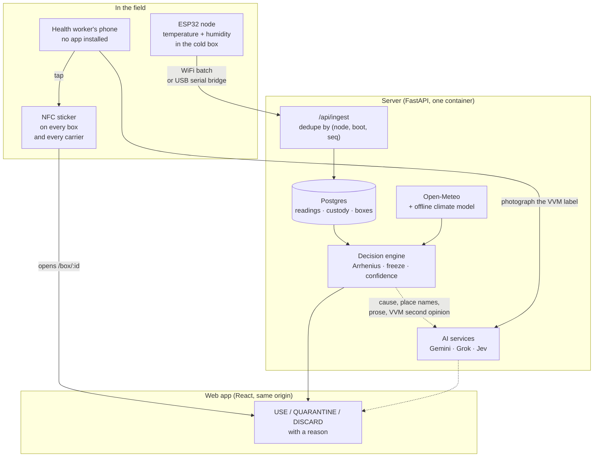

# Architecture

How SecuriVax is put together, from the sensor in the cold box to the verdict on
a health worker's phone.

- [Repo map](#repo-map)
- [System architecture](#system-architecture)
- [The journey of one reading](#the-journey-of-one-reading)
- [The decision engine](#the-decision-engine)
- [Hardware](#hardware)
- [API reference](#api-reference)
- [What runs where](#what-runs-where)
- [Project status](#project-status)

---

## Repo map

| Path | What lives there |
| --- | --- |
| `backend/app/engine/` | The decision engine. Pure functions, no database, no network — given a history, it returns a verdict. 13 modules, ~2,200 lines. |
| `backend/app/services/` | Everything the engine is not allowed to touch: the database, the weather API, Gemini, Grok, Jev. ~2,100 lines. |
| `backend/app/routers/` | The HTTP surface. 9 routers, ~1,200 lines. |
| `backend/simulator/` | Nine shipping lanes that keep running so the app is never empty, plus the node simulator. |
| `backend/app/backtest/` | The 90-day counterfactual on real ERA5 weather that produces the impact numbers. |
| `backend/evals/` | Nine eval suites scoring the AI parts against ground truth. Separate from `pytest`. |
| `web/src/pages/` | The app: boxes, one box, a node, live, climate, impact, stickers, stage. |
| `web/src/landing/` | The scroll story on `/`, including the three.js chapters in `three/`. |
| `web/src/components/` | Shared UI. 29 components. |
| `firmware/src/` | The ESP32 node, plus four diagnostic builds. |
| `Hardware/` | The node's two generations and the bill of materials. The 102 enclosure's CAD is exported to `web/public/hero/models/`, because the landing page renders it live. |
| `docs/` | This folder. |

---

## System architecture



The dotted lines matter: **every AI call is optional.** The verdict is computed by
the engine alone. Gemini, Grok and Jev add a likely cause, place names, prose and
a second opinion on the VVM label. With no API keys set, the app still gives the
same verdict — the rules name the cause instead, and coordinates stand in for
place names. `GET /api/health` reports which are live.

---

## The journey of one reading

```
   node samples every 5 min
        │
        │  queues to flash if offline (~2 weeks, by queue size)
        ▼
   POST /api/ingest/readings        X-Node-Key
        │   validate range, reject bad clocks
        │   dedupe on (node_id, boot_id, seq)
        ▼
   readings table  ──────────────┐
        │                        │
        │                        └──►  GET /api/live/stream (SSE)
        ▼
   GET /api/boxes/{id}/report
        │
        ├─ history.py     stitch the legs this box rode in, across nodes
        ├─ redundancy.py  two sensors: the backup covers a gap in the primary
        ├─ location.py    give each reading a position from the location track
        ├─ environment.py inside vs outside: was it the weather or the carrier?
        ├─ arrhenius.py   spend the product's stability budget, hour by hour
        ├─ vvm.py         if a label was photographed, cross-check it
        ├─ uncertainty.py re-run 400× over sensor bias and batch variation
        └─ verdict.py     one answer, with reasons
        │
        ▼
   USE · USE FIRST · QUARANTINE · DISCARD
```

**Thresholds:** `USE_FIRST` at 40% of the budget, `QUARANTINE` at 75%, `DISCARD`
at 100%. Freezing is checked separately, because it is a different kind of damage
and a heat budget cannot see it.

---

## The decision engine

Pure, testable, and deliberately unaware of the database. `backend/tests/test_engine.py`
covers it with 24 tests that reproduce the Arrhenius anchors exactly.

| Module | Job |
| --- | --- |
| `arrhenius.py` | Two-point Arrhenius model: hours of life left at a constant temperature. |
| `profiles.py` | Per-product stability profiles — what "2 to 8" actually costs for OPV vs pentavalent. |
| `history.py` | Stitch a box's thermal history out of the nodes it rode in. |
| `environment.py` | Inside vs outside: was it the weather, or the carrier? |
| `verdict.py` | Turn a stitched history into USE / QUARANTINE / DISCARD, with reasons. |
| `uncertainty.py` | Monte Carlo over sensor bias, batch variation and starting budget. |
| `vvm.py` | Read a VVM from a photo and cross-check it against the record. |
| `learning.py` | Every confirmed VVM photo sharpens the product's stability model. |
| `twin.py` | A particle filter estimating how much ice a carrier has left. |
| `carrier_model.py` | The thermal model the twin runs forward to forecast a breach. |
| `redundancy.py` | Two sensors in one carrier; the backup covers for the primary. |
| `location.py` | Positions from a separate location track (SmartTag or phone). |

### Why a budget and not a threshold

A threshold logger asks "did it leave 2–8 °C?" — one bit for the whole trip. The
budget asks "how much life did this product lose?", which is a different question
with a different answer per product. Our 90-day backtest is the argument:

| Approach | Unsafe doses used | Good doses binned | Trips breaching | Value lost |
| --- | --- | --- | --- | --- |
| VVM only (today) | 1,699 | 4 | 144 | $1,573 |
| Threshold logger | 0 | **1,121** | 144 | $1,862 |
| SecuriVax | 192 | **0** | 144 | $1,572 |
| SecuriVax + planning | 36 | **0** | **12** | **$305** |

20 seeds × 90 days × 360 trips on real ERA5 weather. The threshold logger catches
every bad dose and still costs more than doing nothing, because it throws away
1,121 good ones. Reproduce with `backend/evals/run.py`; live numbers at `/api/impact`.

---

## Hardware

### The node

```
                    ┌──────────────────────────────┐
   3.7V LiPo ──────►│  TP4056 charge + protection  │
                    └──────────────┬───────────────┘
                                   │ 3.3V
                    ┌──────────────▼───────────────┐
                    │          ESP32 (WROOM)       │
                    │                              │
   SHT31 ───I2C────►│ SDA 21 / SCL 22              │
   DS18B20 ─1-Wire─►│ GPIO 13  (4.7k pull-up)      │──── WiFi ───► /api/ingest
   DHT11/22 ───────►│ GPIO 4                       │
   NEO-6M GPS ─────►│ RX 16 / TX 17, power 25      │──── USB  ───► serial bridge
   battery divider ►│ GPIO 35 (ADC1, 100k/100k)    │
                    └──────────────────────────────┘
```

| Pin | Use | Notes |
| --- | --- | --- |
| 21 / 22 | I2C SDA / SCL | SHT31 (±0.2 °C) — the design sensor |
| 13 | DS18B20 1-Wire | Product probe in a water vial; needs a 4.7k pull-up |
| 4 | DHT11 / DHT22 | The cheap fallback; DHT11 is ±2 °C and blind below 0 |
| 16 / 17 | GPS UART | NEO-6M; `HAS_GPS 0` by default |
| 25 | GPS power | Drives a load switch so GPS isn't always on |
| 35 | Battery ADC | Behind a 100k/100k divider |

Never 6–11 (flash), 1/3 (UART0), 12 (flash voltage at reset), or 34–39 (input only).
Copy `firmware/include/config.example.h` to `config.h` and fill it in — `config.h`
is gitignored because it holds the node key.

### Firmware builds

| Build | Command | What it does |
| --- | --- | --- |
| `node` | `pio run -e node -t upload` | Battery build: a reading every 5 min, deep sleep between, check-in every 15. |
| `demo` | `pio run -e demo -t upload` | Stage build: awake, a reading every 5 s, uploads each one. |
| `replay` | `pio run -e replay -t upload` | **No sensor fitted.** Replays a scripted trip over serial; the BOOT button steps through cooler → vehicle → hot vehicle → freezer pack. |
| `scan` | `pio run -e scan -t upload` | Finds which sensor is on which pin. |
| `diag` | `pio run -e diag -t upload` | Watches two pins closely: rest voltage under each pull, every transition after the DHT start signal, and a 40-bit decode. |
| `i2c` | `pio run -e i2c -t upload` | Talks to each I2C candidate in its own language, so an address that merely acknowledges can't masquerade as a sensor. |

A node with no WiFi can still report over USB:

```bash
cd backend && NODE_KEY=<the key> .venv/bin/python -m scripts.serial_bridge \
  --port /dev/cu.usbserial-0001 --api https://securivax.onrender.com
```

---

## API reference

Everything is under `/api`. Reading needs no account; changing anything needs an
operator. The node authenticates with `X-Node-Key`.

### Ingest — the node's side

| Method | Path | Purpose |
| --- | --- | --- |
| POST | `/api/ingest/readings` | Batch upload. Dedupes on `(node, boot, seq)`, returns the worst verdict in the carrier and whether anyone is watching live. |
| POST | `/api/ingest/locations` | Batch positions from a SmartTag or a phone. |

### Boxes — the health worker's side

| Method | Path | Purpose |
| --- | --- | --- |
| GET | `/api/boxes` | Every box with its verdict and budget. |
| GET | `/api/boxes/{id}/report` | The full report: segments, reasons, confidence, per-leg cause. |
| GET | `/api/boxes/{id}/counterfactual` | The same thermal history against other products. |
| GET | `/api/boxes/fleet/summary` | Verdict counts, next to what a plain threshold logger would have said. |
| POST | `/api/boxes/{id}/explain` | Place names (Gemini) and a prose report (Grok). Falls back to a template. |
| POST | `/api/boxes/{id}/load` · `/unload` · `/checkpoint` · `/receive` | Custody. Operator only. |
| POST | `/api/boxes/{id}/vvm` | Read a VVM photo: CV measurement plus Gemini's second opinion. |
| POST | `/api/boxes/{id}/vvm/{check}/confirm` | A human confirms, and the product's model learns. |

### Nodes, live and climate

| Method | Path | Purpose |
| --- | --- | --- |
| GET | `/api/nodes` · `/api/nodes/{id}` | Carriers and their state. |
| GET | `/api/nodes/{id}/forecast` | The particle-filter twin: when this carrier leaves 2–8 °C, with an 80% range. |
| POST | `/api/nodes/{id}/agent` | The Gemini dispatch agent: continue, divert or hold. Falls back to rules. |
| GET | `/api/live/recent` · `/api/live/stream` | The live feed; the stream is SSE, capped at 50 concurrent. |
| GET | `/api/climate/stores` · `/carriers` · `/api/facilities` | Heat risk and carrier twins. |
| GET | `/api/impact` | The 90-day backtest. |
| GET | `/api/health` | What's configured — never the values. |

---

## What runs where

One container serves both the API and the built web app, so an NFC sticker, the
app and the API share a domain and a tap never crosses an origin.

```
  Render (Docker, always-on)          Render Postgres 16
  ┌────────────────────────────┐      ┌──────────────────┐
  │ FastAPI  /api/*            │─────►│ readings         │
  │ Static   /  (built React)  │      │ custody · boxes  │
  │ Lifespan: migrate, seed,   │      │ accounts         │
  │   backfill 9 lanes, warm   │      └──────────────────┘
  │   weather, keep lanes live │
  └────────────────────────────┘
```

Startup is automatic: schema, additive migration, seed if empty, backfill ~3,000
readings across nine lanes, warm the weather cache in a background thread. A
`_keep_lanes_live` task ticks every two minutes so nothing goes stale mid-demo.

Deploy: `render.yaml` as a Blueprint. Secrets (`OPERATOR_TOKEN`, `NODE_KEY`,
`GEMINI_API_KEY`, `XAI_API_KEY`, `TYPESAFE_API_KEY`) are marked `sync: false` and
typed in at apply time. Full steps in [deploy.md](deploy.md).

### Running it locally

```bash
cd backend && python -m venv .venv && .venv/bin/pip install -r requirements.txt
.venv/bin/uvicorn app.main:app --reload --port 8000
```

```bash
cd web && npm install && npm run dev
```

Nothing is required in the environment — every setting has a default, so it boots
on a laptop with an empty `.env` and a SQLite file.

---

## Project status

Honest about what is finished and what is not:

| | |
| --- | --- |
| ✅ **Decision engine** | Complete and tested. 215 backend tests pass, 24 on the engine alone. |
| ✅ **Web app** | Every route works, mobile included. Degrades to a flat drawing if WebGL fails. |
| ✅ **Backtest** | 90 days of real ERA5 weather, 20 seeds, reproducible. |
| ✅ **AI integrations** | Gemini, Grok and Jev, each with a rules fallback and a timeout. |
| ⚠️ **The node** | Firmware is complete and the enclosure is designed, but the bench DHT11 never answered — see [hardware.md](hardware.md). The `replay` build sends a scripted trip so the rest of the chain can be shown end to end. Nothing it sends is presented as measured. |
| ⚠️ **Stability constants** | Anchored on published VVM grades, not manufacturer dossiers. The method is right; the constants are illustrative. |
| ⚠️ **Confidence** | Scenario coverage, not a calibrated probability. It says "holds in 90% of scenarios", never "90% sure". |
